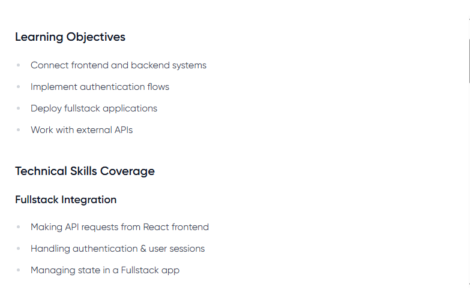
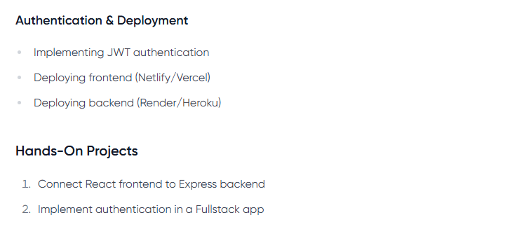
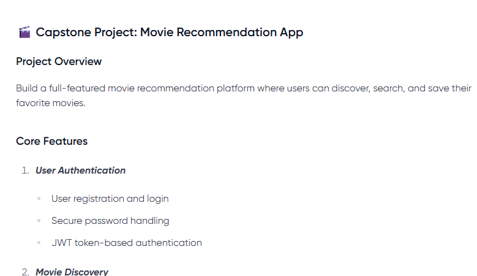

# 🎬 Movie Recommendation App

A full-featured movie recommendation platform where users can discover, search, like, rate, and save their favorite movies.

> 🔐 Built with React, Node.js, Express, MongoDB, and JWT authentication.

---

### 🌐 Live Demo

- **Frontend (Vercel):** [movie-recommendation-app-fkow.vercel.app](https://movie-recommendation-app-fkow.vercel.app)
- **Backend (Render):** [movie-recommendation-app-ia3x.onrender.com](https://movie-recommendation-app-ia3x.onrender.com)

---

### 🧠 Learning Objectives

- Connect frontend and backend systems using APIs
- Implement fullstack authentication flows
- Deploy complete web applications
- Work with external APIs like TMDB (The Movie Database)

---

### 💻 Tech Stack

| Frontend                | Backend                    | Database   | Deployment |
|-------------------------|----------------------------|------------|------------|
| React, React Router     | Node.js, Express.js        | MongoDB    | Vercel + Render |
| Tailwind CSS            | JWT, Bcrypt, Mongoose      |            |            |

---

### 🔐 Core Features

#### 1. User Authentication
- Register and Login with JWT token-based auth
- Secure password handling using bcrypt
- User sessions managed in localStorage

#### 2. Movie Discovery
- Search movies using TMDB API
- Filter by language, year, and genres
- View trending/popular movies

#### 3. Collection & Interaction
- Save favorite movies to personal collection
- Like, rate, and review saved movies
- View similar movie recommendations

---

### 📦 Backend Overview

**Backend Folder Includes:**
- `Express` REST API
- `MongoDB` models for user and movie collections
- `JWT` auth middleware
- `bcrypt` for password hashing
- `.env` for config

**Key Dependencies:**

\`\`\`json
"dependencies": {
  "axios": "^1.10.0",
  "bcrypt": "^6.0.0",
  "cors": "^2.8.5",
  "dotenv": "^16.5.0",
  "express": "^5.1.0",
  "jsonwebtoken": "^9.0.2",
  "mongoose": "^8.15.1"
}
\`\`\`

---

### 🛠️ Project Requirements

To run the project locally:

#### 🚀 Frontend Setup

\`\`\`bash
cd frontend
npm install
npm start
\`\`\`

> Make sure your `.env` contains your backend base URL:  
\`REACT_APP_API_URL=https://movie-recommendation-app-ia3x.onrender.com\`

#### 🧩 Backend Setup

\`\`\`bash
cd backend
npm install
node server.js
\`\`\`

> Create a `.env` file with:

\`\`\`
PORT=5000
MONGO_URI=<your_mongodb_uri>
JWT_SECRET=<your_secret_key>
TMDB_API_KEY=<your_tmdb_api_key>
\`\`\`

---

### 📂 Folder Structure

\`\`\`
├── backend
│   ├── models/
│   ├── routes/
│   ├── middleware/
│   └── server.js
├── frontend
│   ├── components/
│   ├── pages/
│   ├── App.js
│   └── tailwind.config.js
\`\`\`

---

### ✅ Skills Covered

#### Fullstack Integration
- API requests from React
- Handling sessions with JWT
- Managing global app state

#### Auth & Deployment
- JWT authentication
- Frontend (Vercel) + Backend (Render) deployment

#### Hands-On
1. Connected React frontend to Express backend
2. Implemented auth flow with protected routes

---

### 📸 Preview

---

### 🧠 Credits

- Movie Data: [TMDB API](https://www.themoviedb.org/documentation/api)
- UI Styling: [Tailwind CSS](https://tailwindcss.com/)
